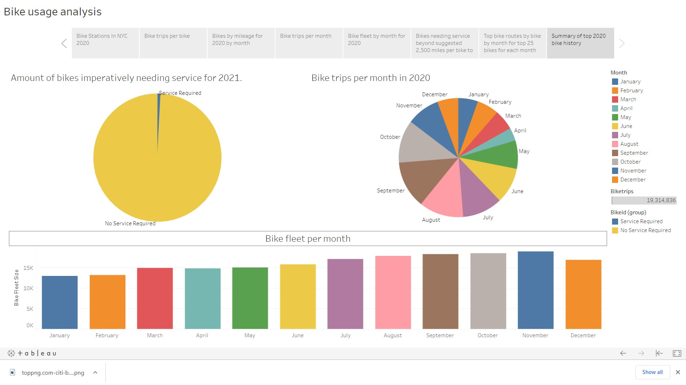

# Citi Bike


## Analysis of top 25 bikes per month in the year 2020, based on mileage and number of routes they have been used for. According to bicyclewarehouse.com a bikes tire should be changed every 2,500 miles.  Taking into account the heavy usage of the bikes, they will need to be maintained without limiting the supply of bicycles needed for CitiBike to operate.  Suprisingly there are bikes that log well over 4,000 miles per year.  So I analyized the monthly usage of these bikes and determined that the slower months which were in 2020 January, February, March, and December were the months which tire changes can occur as well as maintaining any other fixing the bike needs while its there.  Due to COVID-19, which shut us down in March of 2020, I noticed there was a big dip in April of 2020.  I would tend to believe that Citi Bike had a pretty good year due people being tired of staying indoors.  The weather in 2020 was nice and CitiBike provided people with a great outdoor activity.

Files used were the .csv's supplied on the Citi Bike Data webpage (which were not uploaded due to size constraint on git hub 100MB limit.) for each month in 2020.  A jupyter notebook was created to bring in each file and process the data to create 2 csv's.

* bike_history.csv - which contains :
    * bikeid, month, mileage, biketrips, tripduration, hours
    Bike mileage is calculated using all of the lat and lon of each route that bike took for the month through 

    ```
    def distance(lat1,lon1,lat2,lon2):
    if (lat1==lat2 and lon1==lon2):
        return 0
    else:
        R=3961 # Radius of the Earth in miles
        slat = radians(lat1)
        slon = radians(lon1)
        elat = radians(lat2)
        elon = radians(lon2)
        dist = 3961 * acos(sin(slat)*sin(elat) + cos(slat)*cos(elat)*cos(slon - elon))
        return dist
    ```
    There are 12 csv's one for each month.

* top_mileage.csv - which contains all the fields of the original csv's which were supplied by the website plus:
    * month_bikeid - is used in the routing map to provide a unique key when selected.
    * bike_route_order - this numbers the route the bike took for the month... (i.e if the bike had 5 routes for the month then the bike will have 5 records numbered 1,2,3,4,5). This is used when plotting the route of the bike on the map. 

These csv's could have been made smaller by deleting columns which were not used for the analysis.

# Tableau Link:
https://public.tableau.com/profile/joseph.lubrano#!/vizhome/TableauChallenge_16125400242080/Topbikehistoryof2020?publish=yes

or

https://public.tableau.com/views/TableauChallenge_16125400242080/Topbikehistoryof2020?:language=en&:display_count=y&publish=yes&:origin=viz_share_link


## When viewing story please click on full screen viewing located at the bottom right corner of the page.


## Below are screenshots of my story:


* Shows all bike stations in NYC in 2020


* Number of trips by bikeid for each month in 2020


* Mileage by bikeid for each month in 2020.


* Patrons per month in 2020.


* Fleet size by month in 2020.


* Number of bikes in desperate need of service in 2020.


* Interactive map showing routes taken by a bikeid user select for given month in 2020.


* Summary dashboard of graphs above.
